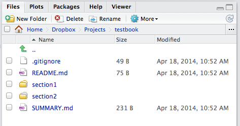

Creating a new Gitbook is a two step processes. First, the `newGitbook` function will create the initial set of files in the directory specified.


```r
> newGitbook("testbook")
```


```
Creating /Users/jbryer/Dropbox/Projects/testbook
Writing .bookignore...
Writing .gitignore...
Writing README.md...
Writing SUMMARY.md...
You can now open README.md and SUMMARY.md. Once you are done 
editting SUMMARY.md, initGitbook() will create the file and folder 
structure for your new Gitbook.
```

Here, we see the initial set of files the `newGitbook` created.

```
Jasons-MacBook-Air:testbook jbryer$ ls -la
total 32
drwxr-xr-x    6 jbryer  staff   204 Apr 18 10:52 .
drwxr-xr-x  110 jbryer  staff  3740 Apr 18 10:52 ..
-rw-r--r--    1 jbryer  staff    35 Apr 18 10:52 .bookignore
-rw-r--r--    1 jbryer  staff    49 Apr 18 10:52 .gitignore
-rw-r--r--    1 jbryer  staff    75 Apr 18 10:52 README.md
-rw-r--r--    1 jbryer  staff   231 Apr 18 10:52 SUMMARY.md
```

The `README.md` file contains the introduction page of your book and the `SUMMARY.md` file contains the structore, or table of contents, of your book. The `.bookingore` and `.gitignore` spefies files that should be ignored by Gitbook and Git, respectively. They contain the typical set of files to be ignored but can be editted as necessary.

At this point, you should edit the `SUMMARY.md` file to reflect your book's outline. Although you will eventually be working with R markdown files (with `.Rmd` file extensions), the links in this file should be to the `.md` version. Once your outline is complete, the `initGitbook` function will create all the R markdown files specified in `SUMMARY.md`.


```r
> initGitbook()
```


Here is the file structure as it appears in RStudio.



Now that all the required files are created, you can edit each file writing your book. Each `.Rmd` file contains a Knitr chunk at the top, not to be echoed or output printed, containing some basic Knitr options. The full list of supported options is available at [http://yihui.name/knitr/options](http://yihui.name/knitr/options).

